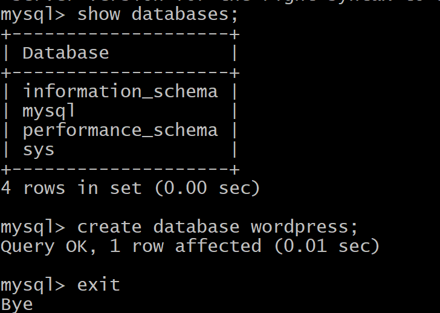
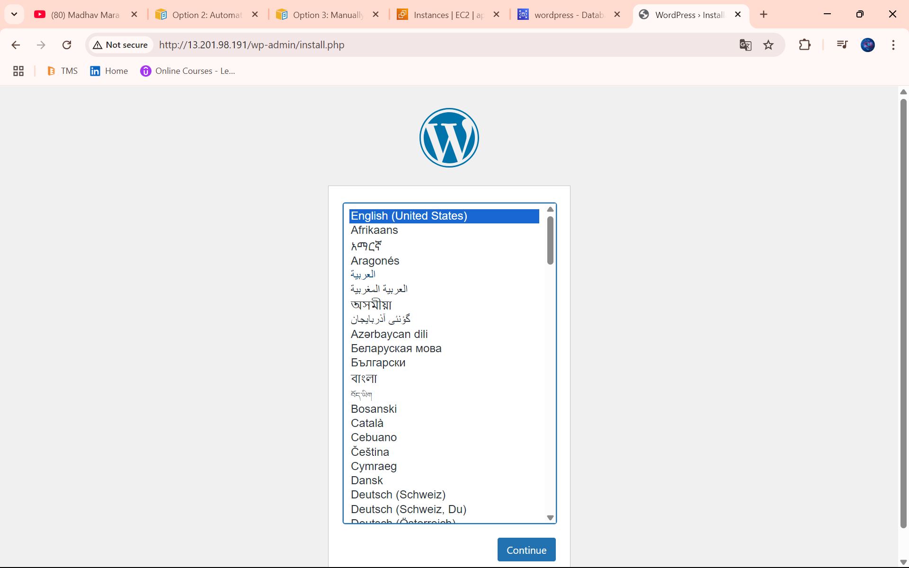

# 📦 Title: Connecting AWS RDS with an EC2 instance


## 🌐 WordPress on EC2 with RDS (MySQL) – DevOps Setup

This project demonstrates how to deploy a WordPress website using:
- AWS EC2 (Ubuntu)
- AWS RDS (MySQL)
- Apache2 + PHP
- Secure SSH access

---

## 📌 Project Architecture

- **EC2** hosts the WordPress frontend (Apache, PHP)
- **RDS** provides a separate managed MySQL database
- SSH connection is secured via `.pem` key
- WordPress config connects to RDS endpoint

---

## ⚙️ Technologies Used

- AWS EC2 (Ubuntu 22.04)
- AWS RDS (MySQL, Free Tier)
- Apache2, PHP, MySQL Client
- WordPress CMS
- Git Bash (for SSH access on Windows)

---

## 🛠️ Create and Configure AWS RDS MySQL Database

1. **Open RDS** in the AWS Console.
2. **Create Database**
   - Choose database creation method: **Easy Create**
   - Configuration: **MySQL**
   - DB instance size: **Free tier**
   - DB instance identifier: `wordpress`
   - Master username: `admin`
   - Master password: `YourPassword123`
   - Confirm password: `YourPassword123`
3. Click **Create database**.

---

## 🔗 Connect EC2 to RDS

1. Select your database in the RDS console.
2. Click **Options** and choose **Set up EC2 connection**.
3. Choose your EC2 instance and continue setup as guided.

---

## 🔐 Connect to EC2 Instance

```bash
cd ~/Downloads
chmod 400 jenkins.pem
ssh -i jenkins.pem ubuntu@<EC2-PUBLIC-IP>
```

---

## 🧪 Install MySQL Client and Test RDS Connection

```bash
apt update -y
apt install mysql-client -y

mysql -h your-rds-endpoint.amazonaws.com -u admin -p
```

**Test queries:**
```sql
show databases;
create database wordpress;
```

---

## 🧰 Install Apache, PHP, and WordPress

```bash
apt install apache2 php php-mysql libapache2-mod-php wget unzip -y

cd /tmp
wget https://wordpress.org/latest.tar.gz
tar -xvzf latest.tar.gz
sudo mv wordpress /var/www/html/
sudo chown -R www-data:www-data /var/www/html/wordpress
```

---

## ⚙️ Configure Apache for WordPress

```bash
sudo nano /etc/apache2/sites-available/wordpress.conf
```

Paste the following:

```apache
<VirtualHost *:80>
    DocumentRoot /var/www/html/wordpress
<Directory /var/www/html/wordpress>
        AllowOverride All
        Require all granted
</Directory>
</VirtualHost>
```

Enable the site and reload Apache:

```bash
sudo a2ensite wordpress
sudo a2dissite 000-default
sudo systemctl reload apache2
```

---

## 🔧 Configure WordPress to Use RDS

```bash
cd /var/www/html/wordpress
cp wp-config-sample.php wp-config.php
sudo nano wp-config.php
```

Set your database details:

```php
define( 'DB_NAME', 'your-db-name' );
define( 'DB_USER', 'admin' );
define( 'DB_PASSWORD', 'YourPassword123' );
define( 'DB_HOST', 'your-rds-endpoint.amazonaws.com' );
```

Restart Apache:

```bash
sudo systemctl restart apache2
```

---

## 🌍 Access Your WordPress Site

Open your browser and go to:  
`http://<EC2-PUBLIC-IP>`

---

**🎉 Your WordPress site is now running with a managed MySQL database on AWS RDS!**




